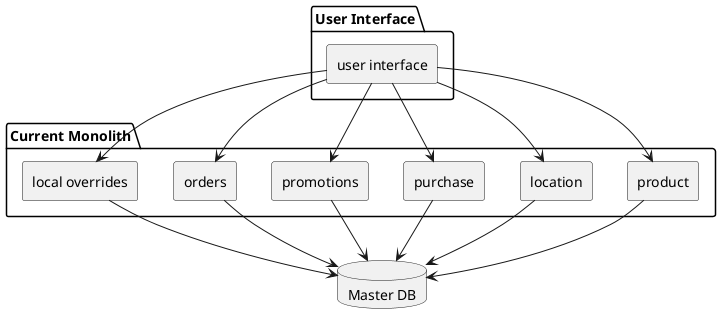
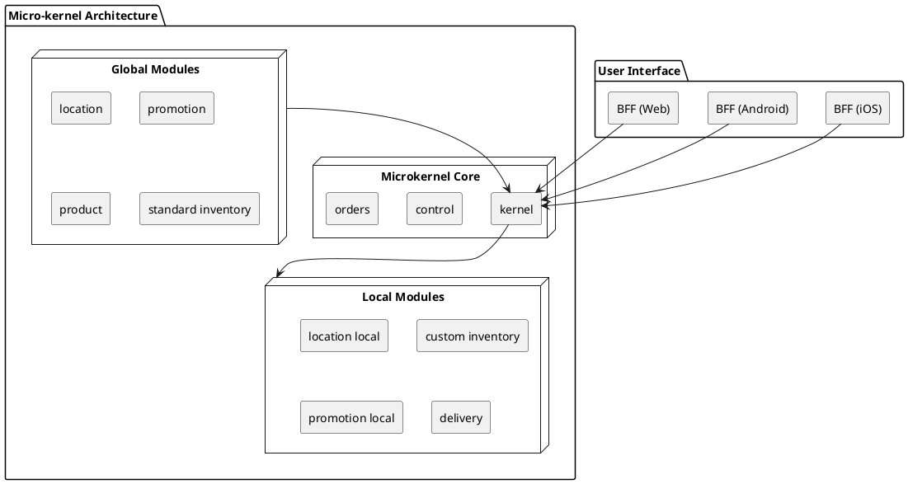

# ADR: Use of Micro-kernel Architecture

## Status
Proposed

## Context
Two key requirements of the system (**promotions** and **location services**) have both global (affects all stores) and local (specific to location) requirements.

The current design features a modular monolith architecture, allowing individual stores to upload their behavior using JAR files.

Currently, stores must specify custom behavior (product specials, promotions, location exemptions) via a JAR file, uploaded to the global site via FTP. Operations must update the JAR, leading to delays in deploying new features.

All local customizations reside in one service and one set of tables in the master database. Over time, as new customizations accrued, it has become a tangled mess.

To allow stores to easily add and customize local behavior, the architects propose moving to a micro-kernel architecture.

### Current Architecture (Figure 1)

###  Proposed Micro-kernel Architecture (Figure 2)

## Decision

The architects decided to migrate the current monolith to become the core system for the new micro-kernel architecture, and to build new functionality via plug-ins.

The new design allows easy updates of global policy (products, inventory, promotions) while enabling local stores to selectively choose those behaviors when appropriate.

## Consequences
- The architects take advantage of this restructuring opportunity to localize databases to individual domains. 
- Communication between services now occurs via messaging. 
- The new design also incorporates the BFF pattern, discussed in ADR 004: BFF for device independence. 
- The design improves the customization workflow significantly:
  - Local plug-in architecture certifies customizations automatically. 
  - Promotions within threshold values go live within 15 minutes. 
  - All stores work with generic workflows via the core system, but can override behaviors for:
    - Promotions
    - Location exemptions
    - Local products